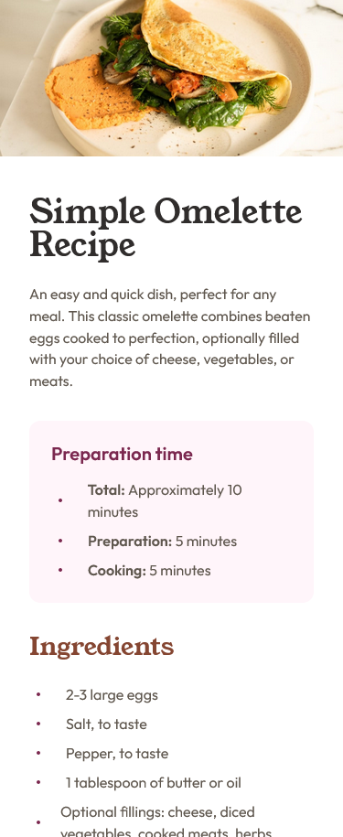
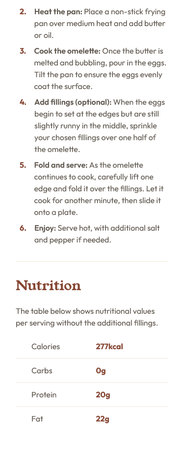
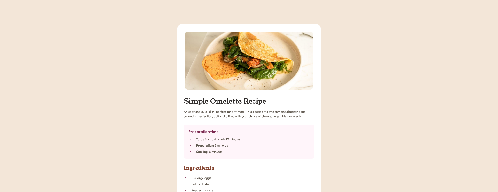
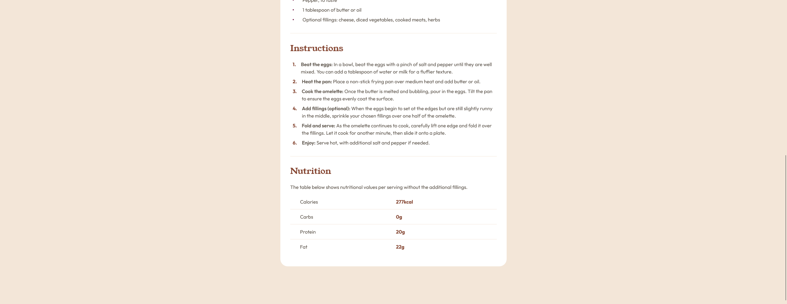

# Frontend Mentor - Recipe page solution

This is a solution to the [Recipe page challenge on Frontend Mentor](https://www.frontendmentor.io/challenges/recipe-page-KiTsR8QQKm). Frontend Mentor challenges help you improve your coding skills by building realistic projects.

## Table of contents

- [Overview](#overview)
  - [Screenshot](#screenshot)
  - [Links](#links)
  - [Built with](#built-with)
  - [What I learned](#what-i-learned)
- [Author](#author)

## Overview

This challenge was a bit difficult for me because to achieve it, I had to avoid using the default <ul> and <ol> tags, which I had never done before.

### Screenshot






### Links

- Live Site URL: [Recipe Page Main](https://my-fm-recipe-page-main.netlify.app/)

## My process

### Built with

- Semantic HTML5 markup
- CSS custom properties
- Flexbox
- CSS Grid
- Mobile-first workflow

### What I learned

I understood the importance of breaking down the design into small, reusable code blocks to make the work easier.

To see how you can add code snippets, see below:

```css
.content-block {
  display: flex;
  flex-direction: column;
  gap: 24px;
  margin-bottom: 32px;
}
```

## Author

- Website - [Luis Manuel Mendoza Guerrero](https://github.com/LMCyber)
- Frontend Mentor - [@LMCyber](https://www.frontendmentor.io/profile/LMCyber)
